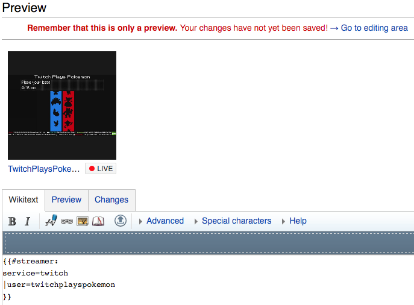

The **Streamer** extension displays information about streamers from various streaming services.  It can display information as simple as online/offline to as extensive as the current thumbnail.

* **Project Homepage:** [Documentation at Github](https://github.com/CurseStaff/Streamer)
* **Mediawiki Extension Page:** [Extension:Streamer](https://www.mediawiki.org/wiki/Extension:Streamer)
* **Source Code:** [Source Code at Github](https://github.com/CurseStaff/Streamer)
* **Bugs:** [Issue Tracker at Github](https://github.com/CurseStaff/Streamer/issues)
* **Licensing:** Streamer is released under [The GNU Lesser General Public License, version 3.0](http://opensource.org/licenses/lgpl-3.0.html).

#Installation

Download and place the file(s) in a directory called Streamer in your extensions/ folder.

Add the following code at the bottom of your LocalSettings.php:

	require_once("$IP/extensions/Streamer/Streamer.php");

Done! Navigate to "Special:Version" on your wiki to verify that the extension is successfully installed.

#Usage

##Tags

###\#streamer - Parser Tag
The #streamer parser tag takes what service is being used, who the user is, and optionally how to display the information.

Basic Syntax:

	{{#streamer:
	service=[Service]
	|user=[User]
	|template=[Template to Use]
	}}

####Parameters for #sprite Tag

|       Parameter       | Description                                                                                                                                                  |
|----------------------:|--------------------------------------------------------------------------------------------------------------------------------------------------------------|
| service               | **Required**: yes The file page containing the image to use.                                                                                             |
| user                  | **Required**: yes The user identifier for user on the streaming service.                                                                                 |
| template              | **Required**: no, **Default**: block, **Built In**: status, mini-status, viewers, thumbnail Use a built in template or specify a custom template to use. |

####Example

To display online/offline status of TwitchPlaysPokemon from the Twitch streaming service:

	{{#streamer:
	service=Twitch
	|user=twitchplayspokemon
	|template=status
	}}

